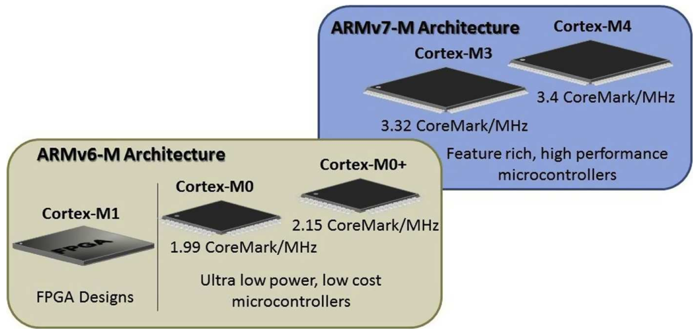
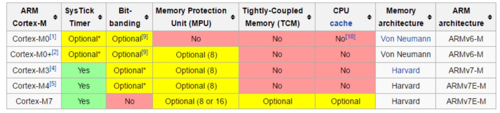
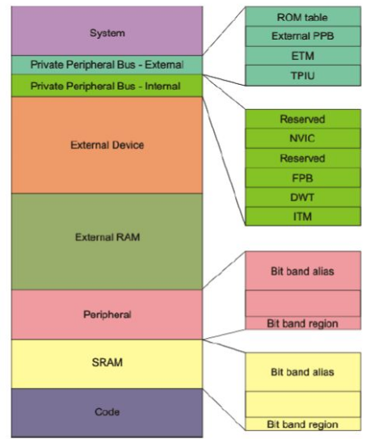
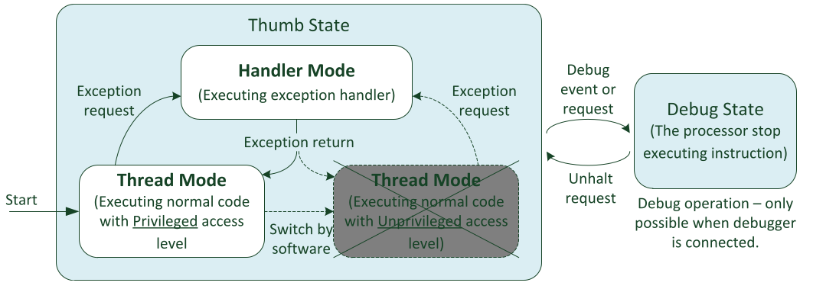
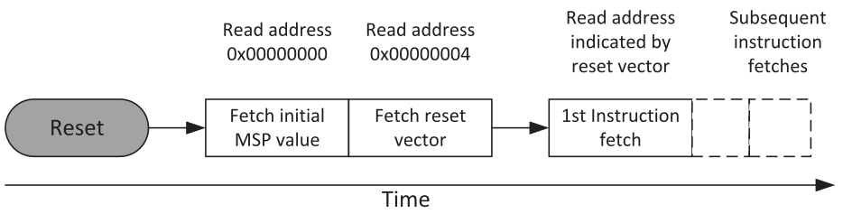

# AdM_Romero Cohorte 20

# Cuestionario Cortex M

## Pregunta 1 inicial
### Describa brevemente los diferentes perfiles de familias de microprocesadores/microcontroladores de ARM. Explique alguna de sus diferencias características.

La empresa ARM se dedica a vender diseños de procesadores pero no a fabricarlos. De esta manera ARM vende la propiedad intelectual de sus diseños y cada fabricante de semicunductores como Texas Instrument integran en sus circuitos integrados los diseño de ARM.

Los diseños de procesadores que cuenta ARM se agrupan según la funcionalidad o caso de uso. De esta manera se agrupan en familias según al área de aplicación al que se destina. Las familias se denominan Cortex A, Cortex R y Cortex M.

La familia Cortex A se orienta a aplicaciones de alto rendimiento, donde se requiere alta performance y paralelismo en las tareas que se desean realizar en un sistema operativo en un sistema embebido. Por lo general estas soluciones requieren muchos núcleos y un uso elevado de memoria RAM. Esta familia se utiliza habitualmente es dispositivos como celulares, tables, etc. de ahí viene la letra A (Aplications).

Por otro lado se encuentra la famiia Cortex R (de realtime). Estos procesadores se orientan a soluciones que requieran sistemas operativos de tiempo real, baja latencia o sistemas críticos. Es decir, ejemplos donde la predictividad y la capacidad de cómputo son requierimientos centrales. Un ejemplo podría ser el freno de un automovíl o un monitor cardíaco.

Por último se encuentra la familia Cortex M. Esta familia se orienta a soluciones generales como sistemas de IoT o pequeños sistemas embebidos de tratamiento no crítico. La letra M viene de Microcontroller y están orientados a ser programados en C con alta densidad de código. A su vez estos procesadores se utilizan cuando la reducción en el consumo de potencia es una características a considerar. 

En la figura se puede observar un resumen de las familiar de los procesadores Cortex:


## Pregunta 1
### Describa brevemente las diferencias entre las familias de procesadores Cortex M0, M3 y M4.

La diferencia principal entre las familias M0 y M3/M4 es que los primeros están orientados a soluciones de bajo consumo y bajo costo, mientras que los segundos incorporar características para cuando se requiere mayor performance.

Como se muestra en la figura los microcontroladores de la familia M0 no incluyen el timer Systick (utiliado habitualmente en sistemas operativos) en cambio los M3, M4 y M7 si lo incluye. Otro aspecto es que los M0 no incluyen protección de memoria (MPU) en cambio los M0+ en adelante tienen la opción. Con respecto a la arquitecura de datos y memeoria los M0 tienen una arquitecura Von Neumann comparado con la Harvard de los M3 en adelante. La arquitectura Harvard tien la ventaja que los datos y las instrucciones van en un único Bus de datos, lo que reduce el tiempo de ejecución de los programas. Por último, los Cortex M3 en adelante disponen la arquitecrua ARM mas actualizada (ARMv7).



Por otro lado respecto al set de instrucciones de las familias, la M0 es la que cuenta con un set reducido destinado a procesamiento general de datos. La familia M3 incorpora instrucciones para la manipulación de bit y la famila M4 cuenta con la capacidad para procesamiento DSP y para trabajar con números en coma flotante.
Los M3/M4 cuentan con una arquitectura de 32 bits tanto para registro como para los buses de datos y pipeline de 3 estapas (fetch, decode y execute).

Con respecto al mapa de memoria los M3/M4 cuenta con una memoria de 4GB con arquitectura Load-Store y set de instrucciones Trumb y Thumbs2. A su vez tiene una característica de bajo consumo, alta densidad de código, control de interrupciones y niveles de privilegios.

## Pregunta 2
### ¿Por qué se dice que el set de instrucciones Thumb permite mayor densidad de código? Explique.

El conjunto de instrucciones utilizado por los procesadores Cortex-M se llama Thumb (esto cubre tanto las instrucciones Thumb de 16 bits como las más nuevas instrucciones Thumb2 de 32 bits). Los procesadores Cortex-M3 y Cortex-M4 incorporan la tecnología Thumb-2 que permite la combinación de instrucciones de 16 y 32 bits para una alta densidad de código y alta eficiencia.

Los procesadores ARM clásicos, por ejemplo, el ARM7TDMIntiene dos estados de operación: un estado ARM de 32 bits y un estado Thumb de 16 bits. En el estado ARM, las instrucciones son de 32 bits y el núcleo puede ejecutar todas las instrucciones compatibles con muy alto rendimiento. En estado Thumb, las instrucciones son de 16 bits, lo que proporciona excelente densidad de código, pero las instrucciones Thumb no tienen toda la funcionalidad que se necesita para completar ciertos tipos de operación. En este sentido la densidad de código se refiere a la reducción en la cantidad de lineas de cógido de programa y la optimización en el procesamiento en cada instrucción.

## Pregunta 3
### ¿Qué entiende por arquitectura load-store? ¿Qué tipo de instrucciones no posee este tipo de arquitectura?

Al igual que cualquier otro procesador ARM, los procesadores Cortex-M se basan en un arquitectura load-store. Esto significa que los datos deben cargarse desde la memoria, se procesan y luego se vuelven a escribir en la memoria usando una serie de instrucciones separadas.
Por ejemplo, para incrementar un valor de datos almacenado en SRAM, el procesador necesita una instrucción para leer los datos de SRAM y colocarlos en un registro dentro del procesador, una segunda instrucción para incrementar el valor del registro, y luego una tercera
instrucción para escribir el valor de nuevo en la memoria. Los detalles de los registros dentro de los procesadores se conocen comúnmente como modelo de programador. Lo que no posee este tipo de arquitectura son instrucciones de alta performance de 32 bits.

Algunas instrucciones definidas en el conjunto de instrucciones Thumb no están disponibles en los procesadores Cortex-M actuales. Por ejemplo, las instrucciones del coprocesador no son compatibles (aunque se podrían agregar motores de procesamiento de datos asignados en memoria separados). Además, algunas otras instrucciones Thumb de los procesadores ARM clásicos no son compatibles como saltos (Branch) con acceso inmediato (usado para cambiar el estado del procesador de Thumb a ARM).

## Pregunta 4
### ¿Cómo es el mapa de memoria de la familia?

Los procesadores Cortex-M3 y Cortex-M4 tienen un pipeline de tres etapas (búsqueda de instrucción, decodificación y ejecución) con arquitectura Harvard que permite la obtención de instrucciones y el acceso a datos simultáneos.
El sistema de memoria de los procesadores ARM Cortex-M utiliza direccionamiento de 32 bits, lo que permite un espacio de direcciones máximo de 4 GB. El mapa de memoria está unificado, lo que significa que aunque puede haber múltiples interfaces de bus, solo hay una memoria de 4GB.
El espacio de memoria es utilizado por el código de programa, los datos, los periféricos, y algunos de los componentes de soporte de depuración dentro de los procesadores.



Si bien es posible almacenar y ejecutar código de programa en SRAM y RAM, el diseño del procesador no está optimizado para dicha operación y requiere uno ciclo de reloj adicional por instrucción para cada búsqueda de instrucción. Como resultado, el rendimiento es ligeramente más lento cuando se ejecutan códigos de programa a través del bus del sistema. La ejecución del programa desde las regiones de memoria de Periféricos, Dispositivos y Sistema no está permitida. El espacio de memoria para NVIC, MPU, SCB y varios periféricos del sistema es llamado espacio de control del sistema (SCS).

## Pregunta 5
### ¿Qué ventajas presenta el uso de los “shadowed pointers” del PSP y el MSP?

El uso de dos shadowed stack pointers tiene ventajas cuando las aplicaciones requieren implementarse con sistemas operativos.
En este sentido cada tarea tiene su PSP y el kernel del sistema operativo utiliza el MSP. Al implementar este tipo de soluciones se pueden destacar las siguientes ventajas:
- Si una tarea encuentra un problema que conduce a una corrupción de la stack, es probable que la stack utilizada por el kernel del sistema operativo y otras tareas aún esté intacta, lo que ayuda a mejorar la confiabilidad del sistema.

- El espacio de stack para cada tarea solo necesita cubrir el uso máximo de stack más un nivel de marco de stack. Espacio de stack necesario para el ISR y la interrupción anidada el manejo se asigna únicamente en el stack principal.

- Facilita la creación de un sistema operativo eficiente para los procesadores Cortex-M. 

- Un sistema operativo también puede utilizar la unidad de protección de memoria (MPU) para definir la region del stack que una tarea de aplicación puede utilizar. Si una tarea de aplicación tiene un desbordamiento de stack, la MPU puede desencadenar una excepción de error de memoria e impedir la tarea.

## Pregunta 6
### Describa los diferentes modos de privilegio y operación del Cortex M, sus relaciones y como se conmuta de uno al otro. Describa un ejemplo en el que se pasa del modo privilegiado a no priviligiado y nuevamente a privilegiado.

Los procesadores Cortex-M3 y Cortex-M4 tienen dos estados de operación y dos modos. Además, los procesadores pueden tener niveles de acceso privilegiados y no privilegiados. El nivel de acceso privilegiado puede acceder a todos los recursos en procesador, mientras que el nivel de acceso sin privilegios significa que algunas regiones de la memoria son inaccesibles. Al nivel no provilegiado también suele llamarse nivel de usuario.

Estados de operación:
- Debug state: cuando el procesador se detiene (por ejemplo, por el depurador o después de alcanzar un punto de interrupción), entra en estado de depuración y deja de ejecutar instrucciones.
- Thumb state: si el procesador está ejecutando código de programa. A diferencia de los procesadores ARM clásicos como ARM7TDMI, no No hay estado ARM porque los procesadores Cortex-M no son compatibles con el procesador ARM.

Modos de operación:
- Handler mode: al ejecutar un controlador de excepciones, como un servidor de interrupción(ISR). Cuando está en modo controlador, el procesador siempre tiene privilegios.

- Handler mode: al ejecutar código de aplicación normal, el procesador puede ser ya sea en nivel de acceso privilegiado o nivel de acceso no privilegiado. Esto está controlado por un registro especial llamado “CONTROL”.

El software puede cambiar el procesador en modo Thread privilegiado a no privilegiado Modo Thread. Sin embargo, no puede volver a pasar de no privilegiado a privilegiado. Si esto es necesario, el procesador debe utilizar el mecanismo de excepción para manejar el cambio. La separación de niveles de acceso privilegiados y no privilegiados permite al programador desarrollar sistemas integrados robustos proporcionando un mecanismo para proteger los accesos a la memoria a regiones críticas y proporcionar un modelo de seguridad básico.

Por ejemplo, un sistema puede contener un kernel de sistema operativo integrado que se ejecuta en provilegiado y tareas de aplicación que se ejecutan en un nivel de acceso sin privilegios. De esta manera, podemos configurar permisos de acceso a la memoria usando la Protección de memoria (MPU) para evitar que una tarea de aplicación dañe la memoria y los periféricos utilizado por el kernel del sistema operativo y otras tareas. Si una tarea de la aplicación falla, el resto de tareas de la aplicación y el kernel del sistema operativo aún pueden continuar ejecutándose. Además de las diferencias en el permiso de acceso a la memoria y el acceso a varios instrucciones especiales, el modelo del programador del nivel de acceso privilegiado y el nivel de acceso sin privilegios es casi el mismo. 

De manera similar, el modo Thread y el modo Handler tienen funciones de programador muy similares. Sin embargo, el modo Thread puede cambiar al uso de una pila de forma separada. Nuevamente, esto permite separar la memoria de pila para las tareas de la aplicación. clasificados a partir de la pila utilizada por el kernel del sistema operativo, lo que permite una mejor confiabilidad del sistema.

De forma predeterminada, los procesadores Cortex-M se inician en modo Thread privilegiado. En muchas aplicaciones sencillas, no es necesario utilizar la opción sin privilegios. 
En estado de debug se utiliza únicamente para operaciones de depuración. A este estado se accede mediante la solicitud del debugger o mediante eventos de depuración generados a partir de componentes de depuración en el procesador. Este estado permite al debugger acceder o cambiar el registro del procesador.



## Pregunta 7
### ¿Qué se entiende por modelo de registros ortogonal? Dé un ejemplo

El término "modelo de registros ortogonal" se refiere a que los registros se pueden utilizar de manera intercambiable para realizar una amplia variedad de operaciones sin restricciones en función de su tipo. Esto significa que, en un modelo ortogonal, los registros no tienen restricciones rígidas en cuanto a su uso en operaciones específicas, lo que proporciona una flexibilidad significativa para los programadores.

En un modelo de registros ortogonal, los registros de propósito general se pueden utilizar para almacenar datos, direcciones de memoria, punteros, valores de retorno de funciones, y para realizar cálculos aritméticos y lógicos. Los registros no se reservan específicamente para un propósito único, como operaciones de acumulador, dirección de pila o direccionamiento de memoria, lo que hace que la arquitectura sea más versátil.

Por ejemplo, los registros de propósito general (R0-R12) pueden utilizarse para almacenar datos, realizar cálculos y realizar operaciones lógicas. Además, el registro R13 generalmente se utiliza como el puntero de pila (SP), y el registro R14 se utiliza para el registro de enlace (LR) en llamadas a funciones y saltos.

```assembly
// Uso de registros de propósito general en un Cortex-M4
MOV R0, #5      ; Mover el valor 5 al registro R0
ADD R1, R0, #3  ; Sumar 3 al valor en R0 y guardar el resultado en R12
```

En este ejemplo, los registros R0 y R1 se utilizan de manera intercambiable para realizar una operación de suma, lo que ejemplifica la flexibilidad de un modelo de registros ortogonal. Esta característica simplifica la programación y permite un uso más eficiente de los registros disponibles en un microcontrolador Cortex-M.

## Pregunta 8
### ¿Qué ventajas presenta el uso de intrucciones de ejecución condicional (IT)? Dé un ejemplo.

La instrucción de TI puede ayudar a mejorar el rendimiento del programa debido a que se evita la penalización por salto, además de reducir el número de instrucciones. Por ejemplo, un programa corto IF-THEN-ELSE secuencia que normalmente requiere salto condicional y un salto incondicional puede ser sustituido por una única instrucción TI.
En algunos otros casos, los métodos de salto tradicionales pueden ser mejores que las instrucciones de TI. porque una instrucción fallida condicional en una secuencia de instrucciones de TI seguirá tomar un ciclo para correr. Entonces, si especificó ITTTT <cond> y la condición falló debido al valor APSR en tiempo de ejecución, podría ser más rápido usar un salto condicional (tres ciclos) que usar el bloque de instrucciones de TI (hasta cinco ciclos en este caso, incluido el instrucción en sí).

```assembly
CMP R1, #10        ; Compara el valor en R1 con 10
ITE EQ             ; Si la comparación es igual (equal), entonces...
LDREQ R0, [R2]     ; ...carga el valor en la dirección apuntada por R2 en R0
```

En este ejemplo, se compara el valor en el registro R1 con 10. Si la comparación es igual (la condición EQ se cumple), entonces la instrucción LDREQ se ejecutará y se cargará el valor en la dirección apuntada por R2 en el registro R0. Si la comparación no es igual, la instrucción LDREQ se omitirá, lo que ahorra ciclos de CPU y mejora la eficiencia del programa.

## Pregunta 9
### Describa brevemente las excepciones más prioritarias (reset, NMI, Hardfault).

Las interrupciones de reset, NMI y Hardfault son las de mayor prioridad y además no pueden configurarse. La de mayor prioridad es la de reset (-3), le sigue NMI (-2 ) y por último hardfault (-1).

La interupción de reset reinicia todo el software y hardware del microcontrolar. De esta manera es la forma de reiniciar drásticamente el sistema. La interrupción NMI (Non-Maskable Interrupt) puede producirse por un perférico por un suceso externo al microcontrolador. Por último la interrupción Hardfault se produce por un inconveniente de software, es decir que un handler no está habilitado.

## Pregunta 10
### Describa las funciones principales de la pila. ¿Cómo resuelve la arquitectura el llamado a funciones y su retorno?

Como en casi todas las arquitecturas de procesadores, los procesadores Cortex-M necesitan memorias stack para operar y tener stack pointers (R13). El stack usa el mecanismo de acceso a memoria del tipo último en entrar, primero en salir. Esto permite que una parte de la memoria se utilice como almacenamiento de datos. La forma de leer y escribir datos en el stack es a partir de mecanismos de PUSH y POP.

El Stack se puede utilizar para:
- Almacenamiento temporal de datos originales cuando es necesario utilizar una función que se está ejecutando (en el banco de registro) para el procesamiento de datos. Los valores se pueden restaurar en el final de la función para que el programa que llamó a la función no pierda sus datos.
- Paso de información a funciones o subrutinas.
- Para almacenar variables locales.
- Para mantener el estado del procesador y registrar valores en el caso de excepciones como una interrupción.

Los procesadores Cortex-M utilizan un modelo de memoria de pila llamado "completamente descendente". Cuando se inicia el procesador, el SP se configura al final del espacio de memoria. Para cada operación de PUSH, el procesador primero disminuye el SP, luego almacena el valor en la ubicación de memoria señalada por el SP. Durante la operación, el SP apunta a la ubicación de la memoria donde se enviaron los últimos datos al pila.
En una operación POP, se lee el valor de la ubicación de memoria señalada por SP y entonces el valor de SP se incrementa automáticamente.
Los usos más comunes de las instrucciones PUSH y POP son guardar contenidos. Al comienzo de la llamada a la función, el contenido de algunos de los registros se puede guardar en la pila usando la instrucción PUSH, y luego restaurados a sus valores originales al final de la función usando la instrucción POP.

## Pregunta 11
### Describa la secuencia de reset del microprocesador.

En los microcontroladores Cortex-M típicos, puede haber tres tipos de reinicio:
- Power on reset. Reinicie todo en el microcontrolador. Esto incluye el procesador y su componente de soporte de debug y periféricos.
- System reset. Reset de procesador y periféricos, pero no el soporte de debug.
- Processor reset. Reset solo del procesador.

La duración del Power on reset o del System reset depende del diseño deñ microprocesador. En algunos casos, el reset requiere varios milisegundos, ya que el controlador de reinicio necesita esperar a que se estabilice el clock. Lo primero que se hace es inicializar el Stack Pointer y luego el Program Counter se dirige al vector de Reset. Este dirige al PC a la memoria de código y comienza la ejecución del programa.

Después del reset y antes de que el procesador comience a ejecutar el programa, el Cortex-M lee los dos primeros words de la memoria. El comienzo de el espacio de memoria contiene el table y las dos primeras palabras de la tabla de vectores son el valor inicial para el Main Stack Pointer (MSP) y el vector de reset. Después de que el procesador lea estas dos palabras, el procesador configura el MSP y el Program Counter (PC) con estos valores. La configuración del MSP es necesaria porque algunas excepciones como el NMI o el handler HardFault podría ocurrir poco después del reinicio y el stack necesitará el MSP hacer un PUSH del estado del procesador antes del manejo de excepciones.



## Pregunta 12
### ¿Qué entiende por “core peripherals”? ¿Qué diferencia existe entre estos y el resto de los periféricos?

En un microcontrolador ARM Cortex-M4, los "core peripherals" se refieren a los componentes esenciales que son parte integral del núcleo del procesador y están disponibles en todos los dispositivos Cortex-M. Estos periféricos son proporcionados directamente por ARM como parte del diseño del núcleo Cortex-M y son esenciales para el funcionamiento del microcontrolador. Algunos de los core peripherals comunes en un microcontrolador Cortex-M incluyen:

- NVIC (Nested Vectored Interrupt Controller): El NVIC gestiona las interrupciones y permite al microcontrolador responder a eventos externos, como entradas de sensores o eventos de temporización.

- SysTick Timer: El temporizador SysTick es un temporizador de sistema que se utiliza comúnmente para generar intervalos de tiempo precisos y para operaciones de temporización en general.

- SCB (System Control Block): El bloque de control del sistema proporciona funciones de control y configuración relacionadas con el núcleo del procesador, como la gestión de la pila y el reinicio del sistema.

- MPU (Memory Protection Unit): La Unidad de Protección de Memoria se utiliza para controlar y proteger el acceso a las áreas de memoria, lo que puede ser útil para garantizar la seguridad y la integridad de datos críticos.

- FPU (Floating-Point Unit): La Unidad de Punto Flotante es responsable de realizar operaciones de punto flotante y acelerar cálculos matemáticos complejos que implican números en formato de punto flotante.

Estos core peripherals son comunes a todos los microcontroladores basados en la arquitectura ARM Cortex-M, independientemente del fabricante específico del dispositivo. Los fabricantes de microcontroladores suelen agregar periféricos adicionales específicos para sus aplicaciones o para diferenciarse en el mercado, pero los core peripherals son esenciales para el funcionamiento básico del procesador y del sistema en general.

## Pregunta 13
### ¿Cómo se implementan las prioridades de las interrupciones? Dé un ejemplo.

Las prioridades de las interrupciones se gestionan mediante el Nested Vectored Interrupt Controller (NVIC). El NVIC es una parte esencial del núcleo Cortex-M y permite administrar las interrupciones en función de sus prioridades. Las interrupciones se pueden configurar con prioridades específicas, y el NVIC se encarga de asignar la CPU a la interrupción con la prioridad más alta pendiente en cualquier momento.

Un ejemplo de cómo se pueden implementar las prioridades de las interrupciones, utilizando el lenguaje de programación C:
```c
#include <stdint.h>
#include "stm32f4xx.h"  // Librería de periféricos para STM32F4

void EXTI0_IRQHandler(void) {
    // Manejo de la interrupción EXTI0
}

void EXTI1_IRQHandler(void) {
    // Manejo de la interrupción EXTI1
}

int main(void) {
    // Configuración de prioridades de interrupción
    NVIC_SetPriority(EXTI0_IRQn, 1); // Prioridad 1 para EXTI0
    NVIC_SetPriority(EXTI1_IRQn, 2); // Prioridad 2 para EXTI1

    // Habilitar las interrupciones EXTI0 y EXTI1
    NVIC_EnableIRQ(EXTI0_IRQn);
    NVIC_EnableIRQ(EXTI1_IRQn);

    // Configuración de los pines GPIO para EXTI0 y EXTI1
    // ...

    while (1) {
        // Bucle principal
    }
}
```

## Pregunta 14
### ¿Qué es el CMSIS? ¿Qué función cumple? ¿Quién lo provee? ¿Qué ventajas aporta?

El CMSIS (Cortex Microcontroller Software Interface Standard) es una especificación desarrollada por ARM para proporcionar una capa de abstracción de hardware común y un conjunto de interfaces de software estándar para los microcontroladores basados en la arquitectura Cortex-M. El CMSIS tiene como objetivo facilitar el desarrollo de software para microcontroladores Cortex-M, independientemente del fabricante específico del microcontrolador, al proporcionar una API (Interfaz de Programación de Aplicaciones) unificada.

Algunas de las funciones y ventajas clave del CMSIS:

- Abstracción de hardware: El CMSIS proporciona una capa de abstracción de hardware que permite a los desarrolladores de software interactuar con el microcontrolador sin necesidad de conocer los detalles específicos del hardware subyacente. Esto facilita la portabilidad del código entre diferentes microcontroladores Cortex-M de diferentes fabricantes.

- API estándar: CMSIS define una serie de funciones estándar para operaciones comunes, como el acceso a registros, la gestión de interrupciones y la configuración de periféricos. Estas funciones se utilizan para escribir código portátil que puede ejecutarse en varios dispositivos Cortex-M.

- Sistema de gestión de interrupciones (NVIC): CMSIS incluye una API para administrar las interrupciones en un microcontrolador Cortex-M, lo que facilita la configuración y el manejo de las interrupciones.

- Periféricos comunes: Define estructuras de registro estándar para periféricos comunes, como temporizadores, puertos GPIO, UART, SPI, I2C, entre otros. Esto facilita la escritura de controladores de periféricos portables.

- Gestión de la configuración del sistema: CMSIS proporciona funciones para la configuración del reloj del sistema y otros aspectos de la configuración del microcontrolador, lo que simplifica la inicialización del hardware.

- Facilita la portabilidad del código: Al utilizar el CMSIS, los desarrolladores pueden escribir código que sea más portátil entre diferentes microcontroladores Cortex-M, lo que reduce el tiempo de desarrollo y el esfuerzo de adaptación a hardware específico.

- Soporte de múltiples fabricantes: El CMSIS se utiliza ampliamente en la industria de microcontroladores y es compatible con microcontroladores de diversos fabricantes, como STMicroelectronics (STM32), NXP (LPC), Atmel (SAM), entre otros.

En resumen, el CMSIS es una especificación estándar desarrollada por ARM para simplificar el desarrollo de software en microcontroladores basados en la arquitectura Cortex-M. Facilita la portabilidad del código, la gestión de interrupciones y la interacción con el hardware subyacente, lo que ahorra tiempo y esfuerzo a los desarrolladores al escribir software para dispositivos Cortex-M de diferentes fabricantes.

## Pregunta 15
### Cuando ocurre una interrupción, asumiendo que está habilitada ¿Cómo opera el microprocesador para atender a la subrutina correspondiente? Explique con un ejemplo.

Cuando ocurre una interrupción el microprocesador opera de la siguiente manera para atender a la subrutina correspondiente:

- Detección de la interrupción: Cuando se produce la fuente de la interrupción, ya sea una señal de hardware o una instrucción de software que genera una excepción, el microprocesador detecta la interrupción.

- Guardar el contexto actual: Antes de saltar a la subrutina de interrupción, el microprocesador guarda el contexto actual en la pila. Esto incluye registros generales, registros de estado y la dirección de retorno. Esta información es importante porque, después de manejar la interrupción, el procesador debe restaurar el contexto anterior para continuar la ejecución donde se detuvo.

- Determinación de la prioridad: El Nested Vectored Interrupt Controller (NVIC) del Cortex-M administra las interrupciones en función de su prioridad. El NVIC determina cuál de las interrupciones pendientes se manejará primero en función de su prioridad. La interrupción con la prioridad más alta se selecciona para su manejo.

- Saltar a la subrutina de interrupción: El procesador cambia la secuencia de ejecución saltando a la dirección de inicio de la subrutina de interrupción correspondiente. Esto es controlado por el NVIC, que apunta al vector de interrupción correcto para la fuente de interrupción activa. La subrutina de interrupción es una función específica que se ha definido previamente para manejar esa interrupción en particular.

- Ejecución de la subrutina de interrupción: La subrutina de interrupción comienza a ejecutarse. Aquí, se realizan las operaciones necesarias para manejar la interrupción, como procesar datos, cambiar estados o responder a eventos específicos.
- Fin de la interrupción y restauración del contexto: Una vez que se ha completado el manejo de la interrupción, la subrutina de interrupción puede devolver el control al programa principal. El microprocesador restaura el contexto previo a la interrupción desde la pila, lo que incluye la dirección de retorno y los registros generales, y luego reanuda la ejecución normal del programa.

- Liberación de la interrupción: El NVIC, al finalizar el manejo de la interrupción, la marca como atendida y permite que otras interrupciones pendientes con una prioridad igual o mayor se procesen si las hubiera.

A continuación, se muestra un ejemplo simplificado:

```c
#include <stdint.h>
#include "CortexM.h" // Biblioteca ficticia para Cortex-M

// Declaración de la subrutina de interrupción
void InterruptHandler(void) {
    // Manejar la interrupción
}

int main(void) {
    // Habilitar las interrupciones
    CortexM_EnableInterrupts();

    while (1) {
        // Bucle principal del programa
    }

    return 0;
}
```

En el ejemplo se habilitan las interrupciones llamando a CortexM_EnableInterrupts().Mientras el programa principal se ejecuta en el bucle while (1), ocurre una fuente de interrupción, como una señal de hardware externa o un temporizador que genera una interrupción. El hardware detecta esta interrupción y activa la correspondiente línea de interrupción. Cuando se activa la interrupción, el control se transfiere automáticamente a la subrutina de interrupción InterruptHandler. El hardware del Cortex-M se encarga de guardar el contexto actual, incluyendo el valor de los registros y la dirección de retorno, en el stack.

Dentro de InterruptHandler, se realizan las operaciones necesarias para manejar la interrupción. Esto podría implicar la manipulación de datos, la actualización de registros o cualquier otra tarea relacionada con la interrupción.

Una vez que InterruptHandler ha terminado de manejar la interrupción, se ejecuta una instrucción de retorno de interrupción. Esta instrucción devuelve el control al punto donde se interrumpió el programa principal. El hardware del Cortex-M restaura el contexto previo desde la pila y reanuda la ejecución del programa principal en el bucle while (1).

## Pregunta 16
### ¿Cómo cambia la operación de stacking al utilizar la unidad de punto flotante?

La unidad de punto flotante (FPU) en un microcontrolador ARM Cortex-M proporciona soporte de hardware para realizar operaciones aritméticas en números en formato de punto flotante, lo que incluye números de punto flotante de simple precisión (float) y doble precisión (double). Cuando se utilizan operaciones de punto flotante en un programa, puede afectar la operación de stacking (apilamiento) en el contexto de manejo de interrupciones y llamadas a funciones. A continuación, se describen algunos de los cambios en la operación de stacking al utilizar la unidad de punto flotante en un Cortex-M:

- Registros de punto flotante: El Cortex-M con FPU tiene un conjunto de registros de punto flotante que se utilizan para realizar operaciones de punto flotante. Estos registros se conocen como registros S (para números de punto flotante de simple precisión) y D (para números de punto flotante de doble precisión). Al utilizar operaciones de punto flotante, es posible que se deban apilar y desapilar estos registros en el contexto de llamadas a funciones o interrupciones. Esto se suma a los registros generales ya presentes en la pila.

- Instrucciones de apilamiento específicas: En un Cortex-M con FPU, existen instrucciones específicas para apilar y desapilar los registros de punto flotante. Estas instrucciones se utilizan para guardar y restaurar los registros de punto flotante en la pila de manera adecuada. Las instrucciones de apilamiento se deben utilizar en combinación con las instrucciones de apilamiento de registros generales estándar.

- Mantener el equilibrio en la pila: Es importante mantener un equilibrio en la pila al apilar y desapilar registros de punto flotante y registros generales. Esto significa que, por cada instrucción de apilamiento, debe haber una instrucción correspondiente de desapilamiento para garantizar que la pila se mantenga en un estado coherente.

- Uso selectivo de la FPU: No todas las funciones o partes del código pueden requerir el uso de la FPU. Es posible habilitar o deshabilitar el uso de la FPU según las necesidades. Si una función no utiliza operaciones de punto flotante, no es necesario apilar ni desapilar los registros de la FPU.

La operación de stacking (apilamiento) cambia al utilizar la unidad de punto flotante debido a la necesidad de gestionar registros de punto flotante adicionales en la pila. Se deben seguir prácticas adecuadas para garantizar que la pila se mantenga en un estado coherente y que las operaciones de punto flotante se utilicen eficientemente cuando sea necesario. Las instrucciones específicas de apilamiento y desapilamiento de la FPU son fundamentales para lograr esto.

## Pregunta 17
### Explique las características avanzadas de atención a interrupciones: tail chaining y late arrival.

Las características avanzadas de atención a interrupciones conocidas como "tail chaining" y "late arrival" son técnicas de optimización utilizadas en la arquitectura ARM Cortex-M para mejorar la eficiencia en el manejo de múltiples interrupciones. Estas características permiten que las interrupciones se manejen de manera más eficiente y reducen la latencia entre la detección de la interrupción y su manejo.

- Tail Chaining (Encadenamiento de Cola): El tail chaining es una técnica que permite al procesador encadenar interrupciones de manera eficiente, lo que significa que cuando una interrupción se está manejando y otra interrupción de igual o mayor prioridad se activa, la segunda interrupción se puede manejar inmediatamente después de la primera, sin necesidad de regresar al programa principal entre ellas. Esta técnica ayuda a reducir la latencia y el tiempo de procesamiento de las interrupciones.

En un procesador Cortex-M que admite el tail chaining, cuando una interrupción A se está manejando y una interrupción B de igual o mayor prioridad se activa, la interrupción B se encola en la "cola de la cola" de la interrupción A. Una vez que se completa el manejo de la interrupción A, el procesador cambia inmediatamente al manejo de la interrupción B, sin tener que volver al programa principal. Esto acelera la respuesta a las interrupciones de alta prioridad.

- Late Arrival (Llegada Tardía): La característica de "late arrival" permite que las interrupciones se detecten incluso después de que se haya comenzado a manejar una interrupción de igual o mayor prioridad. Esto significa que si una interrupción se activa durante el procesamiento de otra interrupción, el procesador puede detectar y procesar la nueva interrupción inmediatamente, incluso si ya está ocupado manejando la primera.

 En un procesador Cortex-M que admite la llegada tardía, si ocurre una interrupción B durante el manejo de una interrupción A, la interrupción B se detectará y manejará inmediatamente, sin necesidad de esperar a que se complete el manejo de la interrupción A. Esto reduce aún más la latencia y permite una respuesta más rápida a las interrupciones de alta prioridad.

## Pregunta 18
### ¿Qué es el systick? ¿Por qué puede afirmarse que su implementación favorece la portabilidad de los sistemas operativos embebidos?

El "SysTick" es un temporizador específico que se encuentra en muchos microcontroladores basados en la arquitectura ARM Cortex-M. Es un temporizador de sistema (system timer) que se utiliza comúnmente en sistemas embebidos para proporcionar una base de tiempo precisa y constante. Las características clave del SysTick son las siguientes:

- Temporizador de sistema: El SysTick es un temporizador específicamente diseñado para proporcionar una base de tiempo a nivel de sistema. Esto significa que es útil para mantener un seguimiento del tiempo, generar retardos y gestionar tareas periódicas.

- Contador de cuenta descendente: El SysTick es un contador de cuenta descendente que se decrementa en cada ciclo de reloj del sistema. Cuando el contador alcanza cero, se genera una interrupción de temporizador.

- Interrupción programable: Se puede configurar el SysTick para generar una interrupción en un valor de conteo específico. Esto lo hace útil para programar tareas periódicas, medir intervalos de tiempo y gestionar actividades basadas en el tiempo.

- Accesible en lenguaje de alto nivel: Los microcontroladores Cortex-M están diseñados para ser programados en lenguajes de alto nivel como C, y el SysTick se puede acceder y programar fácilmente desde estos lenguajes.

- Disponible en muchos microcontroladores Cortex-M: El SysTick es una característica común en muchos microcontroladores Cortex-M, independientemente del fabricante específico del dispositivo. Esto facilita la portabilidad del código entre diferentes microcontroladores Cortex-M.

La implementación del SysTick favorece la portabilidad de los sistemas operativos embebidos por varias razones:

- Base de tiempo estándar: Al utilizar el SysTick como base de tiempo, los sistemas operativos embebidos pueden contar con una base de tiempo estándar y constante en una variedad de microcontroladores Cortex-M. Esto significa que los sistemas operativos pueden programar tareas, realizar conmutaciones de contexto y gestionar el tiempo de manera uniforme en diferentes plataformas.

- Fácil acceso en lenguajes de alto nivel: Al ser accesible desde lenguajes de alto nivel como C, el SysTick se puede programar de manera uniforme en diferentes microcontroladores Cortex-M. Esto facilita la escritura de código portátil para sistemas operativos embebidos.

- Interfaz común para temporización: Los sistemas operativos embebidos a menudo necesitan manejar eventos de temporización, como retardos, planificación de tareas y gestión de intervalos. El SysTick proporciona una interfaz común y consistente para estas operaciones en diferentes microcontroladores Cortex-M.

## Pregunta 19
### ¿Qué funciones cumple la unidad de protección de memoria (MPU)?

La Unidad de Protección de Memoria (Memory Protection Unit, MPU) cumple varias funciones importantes relacionadas con la seguridad y la protección de memoria. A continuación, se describen las funciones clave de la MPU en los microcontroladores Cortex-M:

- Protección de acceso a memoria: La función principal de la MPU es controlar el acceso a áreas específicas de memoria. Puede definir reglas que permitan o restrinjan el acceso a ciertas direcciones de memoria, ya sea para lectura o escritura. Esto es útil para evitar que partes del software o usuarios no autorizados accedan a áreas críticas de memoria.

- Segmentación de memoria: La MPU permite dividir la memoria en segmentos o regiones, y luego asignar permisos específicos a cada región. Por ejemplo, puedes tener una región de memoria destinada a código de aplicación, otra para datos críticos y otra para una pila de sistema. Esto permite un mayor aislamiento y protección entre las diferentes partes del software.

- Protección de registros y periféricos: Además de la memoria RAM y Flash, la MPU también puede utilizarse para proteger registros y periféricos. Puedes definir reglas para restringir el acceso a ciertos registros o bloques de registro, lo que es fundamental para la protección de configuraciones críticas del sistema.

- Protección contra desbordamientos de pila: La MPU puede ayudar a prevenir desbordamientos de pila mediante la definición de límites para la pila. Esto es especialmente útil en sistemas críticos en los que es esencial evitar desbordamientos de pila que podrían causar problemas graves.

- Seguridad de datos y código: La MPU permite controlar el acceso a datos y código, lo que puede ser crucial para garantizar que los datos críticos no se vean comprometidos o para evitar que se ejecute código no autorizado.

- Administración de excepciones: La MPU también se utiliza para administrar excepciones y manejar violaciones de acceso a memoria. Puedes configurar cómo se debe comportar el sistema cuando se intenta acceder a una región de memoria protegida de manera no autorizada, lo que permite tomar medidas específicas, como generar una excepción.

- Aislamiento de tareas o procesos: En sistemas operativos en tiempo real (RTOS) o en entornos multitarea, la MPU se utiliza para aislar y proteger diferentes tareas o procesos. Cada tarea puede tener sus propias reglas de acceso a memoria, lo que evita que una tarea interfiera con la memoria de otra.

## Pregunta 20
### ¿Cuántas regiones pueden configurarse como máximo? ¿Qué ocurre en caso de haber solapamientos de las regiones? ¿Qué ocurre con las zonas de memoria no cubiertas por las regiones definidas?

En la unidad de protección de memoria (MPU) de los microcontroladores Cortex-M, el número máximo de regiones que se pueden configurar varía según el modelo específico del microcontrolador. En general, el número de regiones puede oscilar desde unas pocas hasta varias docenas, dependiendo del diseño del microcontrolador. Algunos microcontroladores Cortex-M permiten configurar un número considerable de regiones, mientras que otros pueden tener limitaciones más estrictas.

En cuanto a los solapamientos de regiones, la MPU generalmente no permite la definición de regiones que se superpongan entre sí. Si intentas configurar regiones con direcciones que se superponen, es probable que obtengas un comportamiento indefinido y la MPU podría no funcionar correctamente.

En lo que respecta a las zonas de memoria que no están cubiertas por las regiones definidas, su tratamiento depende de la configuración de la MPU y del microcontrolador específico. En algunos casos, las zonas no cubiertas por regiones definidas pueden quedar completamente desprotegidas y ser accesibles sin restricciones. En otros casos, el microcontrolador podría aplicar una configuración predeterminada de acceso (por ejemplo, solo lectura) a las zonas no cubiertas por regiones definidas.

La gestión de las zonas no cubiertas y las implicaciones de solapamientos de regiones pueden variar según el fabricante y el modelo del microcontrolador, por lo que es importante consultar la documentación y las especificaciones del microcontrolador específico que estés utilizando para obtener detalles precisos sobre su comportamiento con respecto a la MPU y las regiones de protección de memoria.

## Pregunta 21
### ¿Para qué se suele utilizar la excepción PendSV? ¿Cómo se relaciona su uso con el resto de las excepciones? Dé un ejemplo

La excepción PendSV (Pendable Supervisor Call) se utiliza en microcontroladores ARM Cortex-M principalmente para realizar tareas de cambio de contexto en sistemas operativos en tiempo real (RTOS). Es una excepción de baja prioridad y se utiliza para permitir la conmutación de tareas y gestionar el planificador de tareas en un RTOS. La excepción PendSV se utiliza para mejorar la eficiencia de la conmutación de tareas en entornos multitarea.

La excepción PendSV está relacionada con otras excepciones en el sentido de que se utiliza en conjunción con el sistema de manejo de interrupciones del microcontrolador, especialmente con las excepciones de SysTick y las interrupciones de mayor prioridad. A continuación, se muestra un ejemplo que ilustra cómo se utiliza la excepción PendSV en un contexto de RTOS:

Supongamos que estás utilizando un RTOS en un microcontrolador Cortex-M y tienes varias tareas en ejecución con diferentes prioridades. Cuando ocurre una interrupción de temporizador SysTick, el RTOS puede programar la excepción PendSV para que se ejecute después de la interrupción de SysTick.

```c
#include <stdint.h>
#include "cmsis_cortex_m.h"  // Biblioteca de CMSIS para Cortex-M

// Definición de la tarea actual
volatile uint32_t current_task = 0;

// Función de conmutación de tareas
void PendSV_Handler(void) {
    // Realizar cambio de contexto para la próxima tarea
    // Esto implica guardar el contexto de la tarea actual y restaurar el contexto de la próxima tarea
    // También actualiza el valor de 'current_task' para indicar la próxima tarea a ejecutar
}

// Función de inicio del sistema
int main(void) {
    // Configurar las tareas y prioridades
    // Iniciar el temporizador SysTick para generar interrupciones periódicas

    // Bucle infinito
    while (1) {
        // Ejecutar la tarea actual (current_task)
    }
}
```
En este ejemplo, el RTOS programa la excepción PendSV para realizar el cambio de contexto cuando ocurra una interrupción de temporizador SysTick. La función PendSV_Handler se encarga de guardar el contexto de la tarea actual, restaurar el contexto de la próxima tarea y actualizar la variable current_task para indicar la próxima tarea a ejecutar. Esta conmutación de tareas es esencial para lograr la multitarea en un RTOS.

## Pregunta 22
### ¿Para qué se suele utilizar la excepción SVC? Expliquelo dentro de un marco de un sistema operativo embebido.

La excepción SVC se emplea para realizar llamadas al supervisor o llamadas al sistema, lo que permite a las aplicaciones de usuario y al sistema operativo solicitar servicios y funciones específicas del sistema operativo. A continuación, se explica cómo se utiliza la excepción SVC en el contexto de un sistema operativo embebido:

- Llamadas al sistema: En un sistema operativo, es común que las aplicaciones de usuario requieran servicios o funciones específicas proporcionadas por el sistema operativo, como la creación de procesos, acceso a archivos, gestión de recursos, etc. En lugar de permitir un acceso directo a estas funciones, el sistema operativo expone una interfaz de llamada al sistema a través de llamadas a funciones especiales. Estas llamadas se realizan a través de la excepción SVC.

- Gestión de privilegios: El sistema operativo se ejecuta en un nivel privilegiado superior al de las aplicaciones de usuario. La excepción SVC actúa como un mecanismo de transición entre el modo de usuario y el modo de supervisor o kernel. Cuando una aplicación de usuario necesita un servicio del sistema operativo, hace una llamada al sistema a través de la excepción SVC, lo que permite al sistema operativo ejecutar la función en su nivel de privilegio.

- Parámetros y códigos de llamada: Las llamadas al sistema a través de la excepción SVC suelen incluir parámetros y un código de llamada (syscall code) que identifica el servicio o función solicitada. El sistema operativo utiliza el código de llamada y los parámetros para determinar qué acción tomar y cómo manejar la solicitud.

- Aislamiento y seguridad: La excepción SVC proporciona aislamiento y seguridad, ya que garantiza que las aplicaciones de usuario no puedan acceder directamente a áreas críticas del sistema operativo o realizar operaciones privilegiadas sin la aprobación del sistema operativo.

- Gestión de excepciones personalizadas: Las excepciones SVC también permiten al sistema operativo gestionar excepciones personalizadas, lo que significa que el sistema operativo puede definir y manejar servicios y funciones específicas de manera flexible.

# ISA

## Pregunta 1
### ¿Qué son los sufijos y para qué se los utiliza? Dé un ejemplo.

Los sufijos en el contexto de una arquitectura de conjunto de instrucciones (ISA, por sus siglas en inglés) se utilizan para especificar el tamaño de los datos o registros en una instrucción. Los sufijos permiten adaptar una instrucción a diferentes tamaños de datos sin tener que escribir múltiples instrucciones diferentes.

En la arquitectura ARM Cortex-M, se utilizan sufijos para especificar el tamaño de los datos en las instrucciones de carga, almacenamiento y manipulación de datos. Los sufijos comunes en la arquitectura Cortex-M son los siguientes:

    B: Byte (8 bits)
    H: Halfword (16 bits)
    S: Singleword (32 bits)
    D: Doubleword (64 bits)

Por ejemplo, considera una instrucción de carga (LDR) en un Cortex-M que utiliza un sufijo para especificar el tamaño de los datos:

```assembly
LDRB R0, [R1]   ; Carga un byte desde la dirección apuntada por R1 en R0
LDRH R2, [R3]   ; Carga una media palabra (halfword) desde la dirección apuntada por R3 en R2
LDR  R4, [R5]   ; Carga una palabra (singleword) de 32 bits desde la dirección apuntada por R5 en R4
```
En el primer ejemplo, la instrucción LDRB carga un byte (8 bits) desde la dirección apuntada por R1 en el registro R0. En el segundo ejemplo, la instrucción LDRH carga una media palabra (16 bits) en R2. Finalmente, la tercera instrucción LDR carga una palabra (32 bits) en R4.

Estos sufijos permiten a los programadores escribir código más eficiente y legible al especificar el tamaño de los datos de manera clara en las instrucciones. También facilitan la programación de operaciones de carga y almacenamiento de datos en diferentes tamaños de datos sin necesidad de utilizar múltiples instrucciones distintas.

## Pregunta 2
### ¿Para qué se utiliza el sufijo ‘s’? Dé un ejemplo.

El sufijo 's' se utiliza para indicar que una instrucción aritmética o lógica debe actualizar el registro de estado (usualmente el registro CPSR o APSR), que almacena banderas o flags de estado, como el flag de cero (Z), el flag de sobreflujo (V), el flag de acarreo (C), el flag de desbordamiento (O), entre otros. Cuando se usa un sufijo 's' en una instrucción, se indica que se desea que la instrucción actualice el estado de los flags en el registro de estado según el resultado de la operación realizada.

A continuación, se muestra un ejemplo de cómo se utiliza el sufijo 's' en una instrucción en un Cortex-M:

```assembly
ADDS R0, R1, R2
```
En esta instrucción, 'ADDS' es una instrucción de suma en la que 'R0' es el registro de destino y 'R1' y 'R2' son los operandos. El sufijo 's' indica que después de realizar la suma, se actualizarán los flags en el registro de estado en función del resultado. Por ejemplo, si la suma da como resultado cero, se establecerá el flag Z en el registro de estado, y si hay un desbordamiento, se establecerá el flag V.

El uso de sufijos 's' es especialmente útil en programación ensambladora cuando necesitas tomar decisiones basadas en el resultado de una operación, ya que puedes realizar una operación y luego realizar una comparación basada en las banderas de estado actualizadas para decidir qué hacer a continuación. Por ejemplo, puedes usarlo para implementar una declaración condicional como un salto condicional o para realizar un control de flujo más avanzado en tu programa.

## Pregunta 3
### ¿Qué utilidad tiene la implementación de instrucciones de aritmética saturada? Dé un ejemplo con operaciones con datos de 8 bits.

La aritmética saturada es una técnica en la que las operaciones aritméticas se realizan de manera que los resultados se "saturan" o limitan a un valor máximo o mínimo en lugar de desbordar cuando exceden el rango válido. Esta técnica es especialmente útil en aplicaciones en las que es importante evitar desbordamientos que puedan dar lugar a resultados incorrectos o a problemas de seguridad.

En el contexto de un microcontrolador Cortex-M, la implementación de instrucciones de aritmética saturada permite realizar operaciones aritméticas que mantienen los resultados dentro de un rango específico, incluso si los resultados de la operación exceden ese rango. Esto es útil en aplicaciones donde los valores de datos no deben exceder ciertos límites para garantizar la integridad de los datos o para evitar comportamientos inesperados.

Se muestra un ejemplo de operaciones con datos de 8 bits utilizando instrucciones de aritmética saturada en un Cortex-M:

Supongamos que estamos trabajando con valores de 8 bits sin signo y queremos realizar una suma saturada de dos valores. Si la suma excede el valor máximo de 255 (0xFF) o cae por debajo de 0, en lugar de desbordar, los valores se saturarán a 255 o 0, respectivamente.

```c
#include <stdint.h>

uint8_t AddWithSaturation(uint8_t a, uint8_t b) {
    uint16_t result = (uint16_t)a + (uint16_t)b;

    if (result > 255) {
        return 255;  // Saturar el resultado al valor máximo
    } else {
        return (uint8_t)result;
    }
}

int main(void) {
    uint8_t value1 = 200;
    uint8_t value2 = 150;
    uint8_t sum = AddWithSaturation(value1, value2);  // La suma se satura a 255

    // 'sum' ahora contiene 255

    while (1) {
        // Bucle principal del programa
    }

    return 0;
}
```
En este ejemplo, la función AddWithSaturation toma dos valores de 8 bits y realiza una suma saturada, lo que significa que si el resultado de la suma excede 255, se satura a 255. Esto evita desbordamientos y garantiza que el resultado esté dentro de un rango válido para aplicaciones específicas.

La aritmética saturada es especialmente útil en aplicaciones de procesamiento de señales, procesamiento de imágenes, control de motores y en cualquier otro contexto donde se desee mantener los valores dentro de límites definidos para evitar resultados inesperados.

## Pregunta 4
### Describa brevemente la interfaz entre assembler y C ¿Cómo se reciben los argumentos de las funciones? ¿Cómo se devuelve el resultado? ¿Qué registros deben guardarse en la pila antes de ser modificados?

La interfaz entre lenguaje ensamblador (assembly) y C en un microcontrolador ARM Cortex-M implica la forma en que las funciones escritas en ensamblador se comunican con el código escrito en C y viceversa. Esto es importante para garantizar que las funciones escritas en lenguaje ensamblador se integren de manera efectiva en el código C y se cumplan las convenciones de llamada.

En un Cortex-M, los argumentos de las funciones se pasan generalmente a través de registros específicos, como R0, R1, R2, etc. Para las funciones escritas en lenguaje ensamblador, es importante conocer cuáles registros se utilizan para recibir los argumentos y dónde se encuentran los valores de los argumentos en esos registros.

El resultado de una función puede devolverse a través del registro R0, que se utiliza comúnmente para almacenar el valor de retorno. Para las funciones escritas en lenguaje ensamblador, es importante garantizar que el resultado se coloque en el registro R0 antes de salir de la función.

Antes de modificar los registros que no son argumentos o valores de retorno, generalmente es necesario guardar su contenido en la pila. Esto es especialmente importante si la función escrita en lenguaje ensamblador utiliza registros que se utilizan en otras partes del programa. La pila se utiliza para preservar el estado de los registros antes de modificarlos y restaurar ese estado después de que la función haya terminado.

La gestión de la pila (stack) es una parte importante de la interfaz entre lenguaje ensamblador y C en un Cortex-M. Se deben seguir las convenciones de llamada específicas del compilador C que se utilice para garantizar una comunicación adecuada entre las funciones en ensamblador y C.

En resumen, la interfaz entre lenguaje ensamblador y C en un Cortex-M implica la forma en que se pasan los argumentos, se devuelve el resultado y se gestiona la pila. Es importante seguir las convenciones de llamada específicas del compilador C utilizado para garantizar una comunicación efectiva entre las funciones escritas en ensamblador y C.

## Pregunta 5
### ¿Qué es una instrucción SIMD? ¿En qué se aplican y que ventajas reporta su uso? Dé un ejemplo.

Una instrucción SIMD (Single Instruction, Multiple Data) es una instrucción de procesador que se utiliza para realizar una operación en paralelo en varios elementos de datos simultáneamente. Estas instrucciones permiten aprovechar la capacidad de procesamiento paralelo en microcontroladores y procesadores modernos para realizar operaciones aritméticas, lógicas y de manipulación de datos en lotes de datos en lugar de operar en un solo elemento a la vez. En el contexto de un microcontrolador Cortex-M, el soporte SIMD puede estar presente en ciertos modelos, como el Cortex-M4, que incluye extensiones de instrucción opcionales como el juego de instrucciones DSP (Digital Signal Processing) que incluye operaciones SIMD.

Las instrucciones SIMD se aplican en una variedad de aplicaciones que requieren el procesamiento eficiente de datos en paralelo, como:

- Procesamiento de señales: Aplicaciones de procesamiento de señales digitales (DSP) como filtrado, convolución, FFT (Transformada Rápida de Fourier), etc.

- Procesamiento de imágenes: Aplicaciones de visión por computadora y procesamiento de imágenes que implican operaciones en píxeles de imágenes.

- Matemáticas de vectores y matrices: Cálculos matriciales y vectoriales en aplicaciones científicas y de ingeniería.

- Codificación y decodificación de medios: Procesamiento de audio y video que requiere codificación y decodificación eficientes.

Las ventajas de utilizar instrucciones SIMD incluyen:

- Mayor rendimiento: Las instrucciones SIMD permiten realizar operaciones en paralelo en múltiples elementos de datos, lo que aumenta significativamente el rendimiento de las operaciones aritméticas y lógicas en comparación con el procesamiento secuencial.

- Eficiencia energética: Al procesar datos en paralelo, se pueden lograr ahorros significativos en energía, ya que el procesador puede completar las tareas más rápidamente y entrar en estados de bajo consumo de energía.

- Optimización de código: Las operaciones SIMD permiten optimizar el código para aprovechar al máximo las capacidades del procesador, lo que resulta en un código más eficiente.

Un ejemplo de una operación de suma vectorial utilizando instrucciones SIMD:
 
```c
#include <stdint.h>
#include <arm_neon.h>  // Biblioteca para instrucciones SIMD

void VectorSum(int16_t* input1, int16_t* input2, int16_t* output, int size) {
    int i;
    int16x8_t vec1, vec2, result;
    
    for (i = 0; i < size; i += 8) {
        vec1 = vld1q_s16(input1 + i);  // Cargar 8 elementos de input1 en un registro SIMD
        vec2 = vld1q_s16(input2 + i);  // Cargar 8 elementos de input2 en un registro SIMD
        result = vaddq_s16(vec1, vec2);  // Sumar los registros SIMD
        vst1q_s16(output + i, result);  // Almacenar el resultado en output
    }
}
```

En este ejemplo, se utiliza la biblioteca arm_neon.h para realizar una suma vectorial de elementos de 16 bits en paralelo utilizando instrucciones SIMD. Esto permite realizar operaciones en lotes de datos de manera eficiente.


